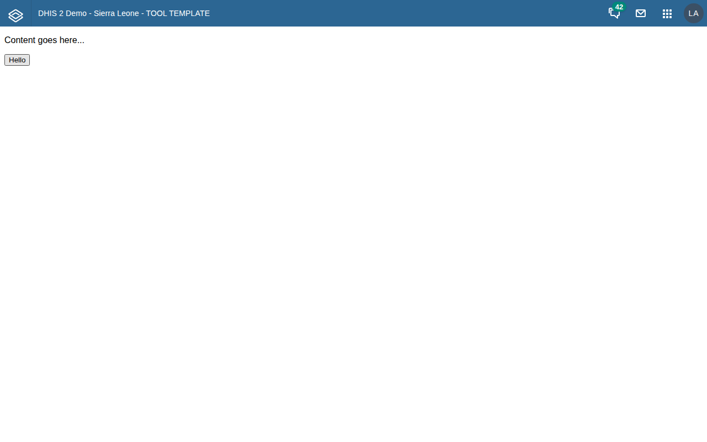
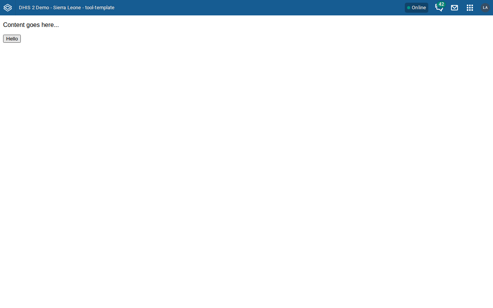
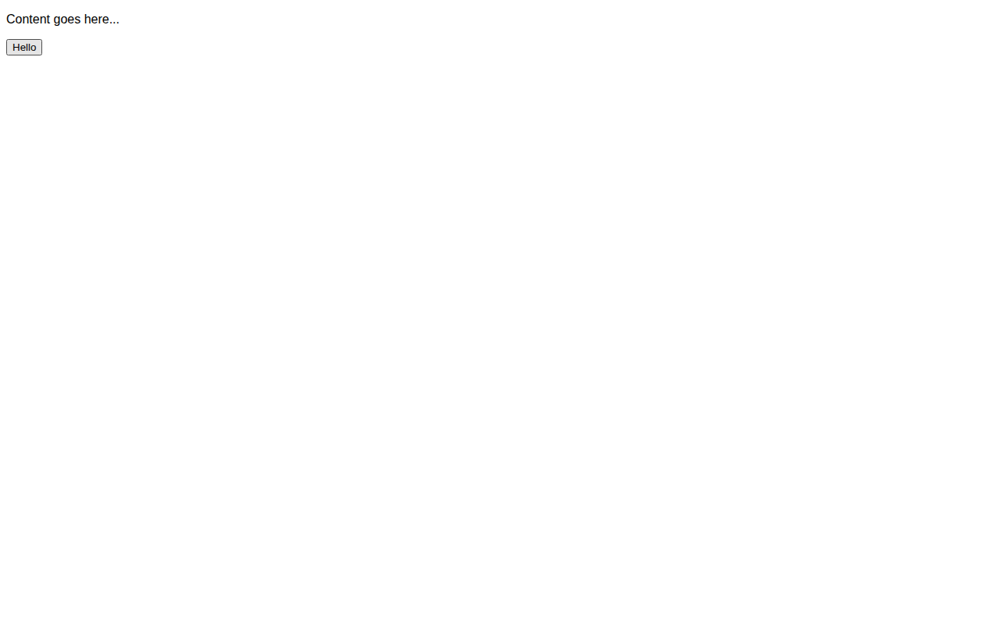

# UI test results: tool-template v0.3.0

Tested: 2026-07-15 · Build under test: `compiled/tool-template.zip` from `yarn run zip` at commit 3ef0362 (+local `.gitignore` edit)
Instances: disposable broker instances (`agent-review-tt-4x`), Sierra Leone demo seeds, one per version, tested sequentially and deleted afterwards. Auth: `local_admin`. Test driver: `e2e/install_and_render.py` (Playwright/Chromium), executed per version by subagents.

## Install + render matrix

| Step | 2.40.12 | 2.41.9 | 2.42.5.1 | 2.43.0.1 |
|---|---|---|---|---|
| Server reachable (`/api/system/info`) | PASS | PASS | PASS | PASS |
| Install zip (`POST /api/apps`) | PASS (204) | PASS (204) | PASS (201) | PASS (201) |
| App listed in `/api/apps` | PASS | PASS | PASS | PASS |
| App renders (`#mainView` found) | PASS (top-level) | PASS (top-level) | PASS (global-shell iframe) | PASS (global-shell iframe) |
| Placeholder content + Hello button visible | PASS | PASS | PASS | PASS |
| Hello click → `alert("Hello world...")` | PASS | PASS | PASS | PASS |
| Hello click → API call logs server version | PASS (`2.40.12`) | PASS (`2.41.9`) | PASS (`2.42.5.1`) | PASS (`2.43.0.1`) |
| Header-bar switch (`check-header-bar.js`) | PASS — legacy bar rendered | PASS — legacy bar rendered | PASS — `#dhis-header-bar` hidden, shell header used | PASS — `#dhis-header-bar` hidden, shell header used |
| Uninstall (`DELETE /api/apps/tool-template`) | PASS (204) | PASS (204) | PASS (204) | PASS (204) |
| Page errors / failed requests | none | none | none | none |

Install status codes differ by design (`204` on ≤2.41, `201` on 2.42+); the test accepts any 2xx.

## Dev-server workflow (tested on 2.42.5.1)

| Step | Result |
|---|---|
| `yarn start` with `.env` pointing at instance (`local_admin` basic auth) | PASS — manifest generated, compiled, JSESSIONID captured by proxy |
| App loads at `http://localhost:8081/` | PASS |
| Hello click → API call + alert | PASS — **but** the API call goes direct/cross-origin, not via the proxy; it succeeds only because the demo DB pre-whitelists `http://localhost:8081` in CORS (see finding M4) |
| Header-bar switch in dev | PASS — bar hidden (server is 2.42) |

## Console noise observed (not app defects)

- All versions: `404 /api/<n>/staticContent/logo_banner` — normal DHIS2 response when no custom logo is configured (raised by the legacy header bar on ≤2.41 and by DHIS2's own global shell on 2.42+).
- 2.42/2.43 only: repeated "This window is not a secure context — PWA features will not work" errors and two `-moz-` stylesheet warnings — emitted by the DHIS2 global shell because the test instance is plain HTTP; unrelated to the app.

## Screenshots

| Version | File |
|---|---|
| 2.40.12 |  |
| 2.41.9 |  |
| 2.42.5.1 |  |
| 2.43.0.1 |  |
| 2.42 dev server |  |
